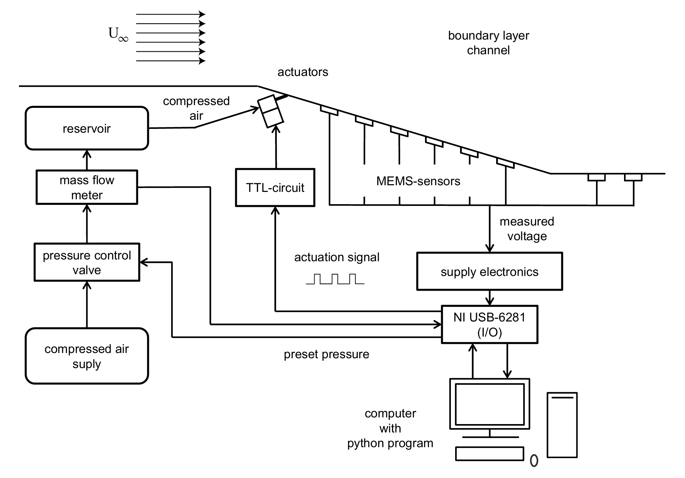

# Active Flow Control with Reinforcement Learning

## Overview

The code in this repository was used to train a dynamic actuation signal for pulsed jet actuators (PJAs) using Proximal Policy Optimization (PPO). The input variable was a measurement of the wall shear stress downstream and the output variable was a corresponding actuation signal for the PJAs. The objective was to find an optimal dynamic blowing pattern to minimize a separation bubble forming at the base of a one-sided diffuser.

## Setup



## Repository Structure
```
├── measurement/                    # Package containing modules for the device communication  
│ ├── coefs/                            # Folder containing files for sensor calibration  
│ │ ├── coefs_sensor_100.txt  
│ │ ├── coefs_sensor_101.txt  
│ │ └── ...  
│ ├── calibration.py                    # Calibration of MEMS sensors  
│ ├── channel.py                        # Channels for NI device  
│ └── sensors.py                        # I/O and Setup of the NI USB-6281  
│  
├── ppo/                            # Package containing modules for the PPO  
│ ├── environment.py                    # Wind tunnel environment for the PPO  
│ ├── network.py                        # Actor-Critic-Network for the PPO  
│ └── training.py                       # PPO Training Algorithm  
│  
├── main.py                         # Main entry point  
├── utils.py                        # Utility functions  
├── afc_ppo.yaml                    # Configuration file  
├── requirements.txt                # Dependencies  
├── .gitignore                      # Git ignore rules  
└── README.md                       # Project overview  
```
